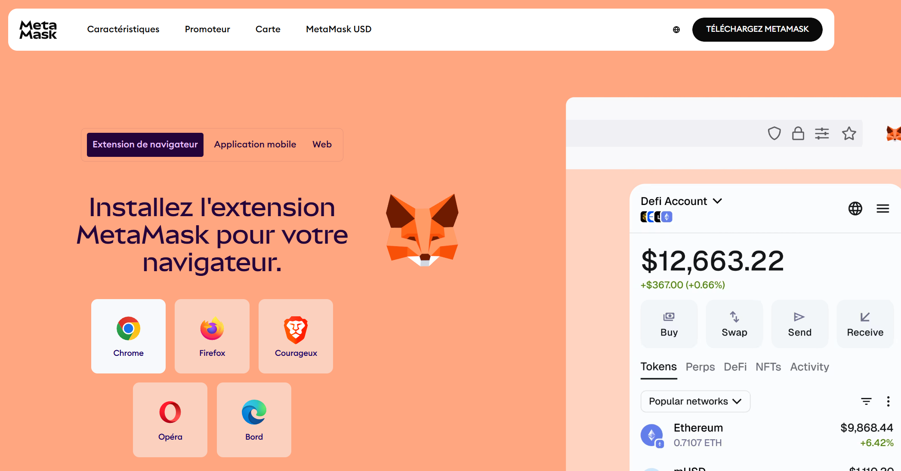
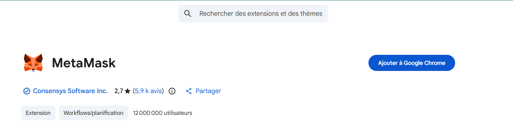
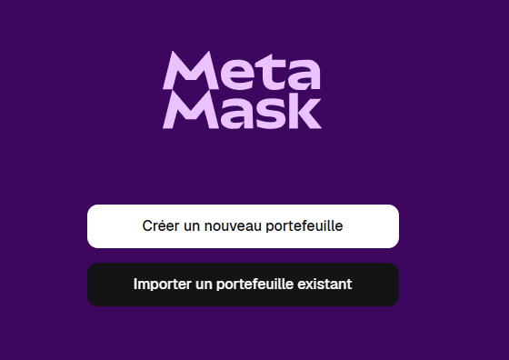
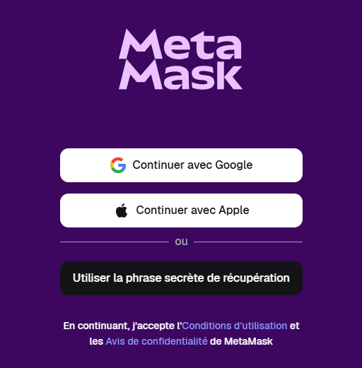
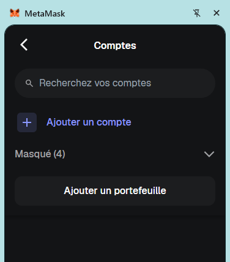
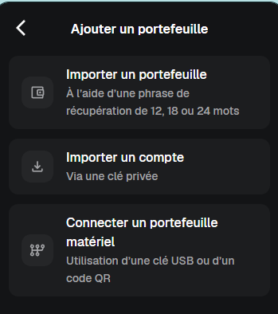
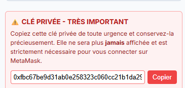

# Guide d'utilisation - CertiChain

Bienvenue sur la page de support CertiChain. Ce guide vous accompagne dans l'utilisation de la plateforme de certification blockchain.

# CertiChain — Guide d'utilisation de la plateforme

---

## Table des matières

1. [Page d'accueil](#1-page-daccueil)
2. [Créer un compte établissement](#2-créer-un-compte-établissement)
3. [Se connecter à l'espace École](#3-se-connecter-à-lespace-école)
4. [Certifier un diplôme](#4-certifier-un-diplôme)
5. [Vérifier un diplôme — espace public](#5-vérifier-un-diplôme--espace-public)
6. [Espace Rectorat](#6-espace-rectorat)
7. [Navigation](#7-navigation)
8. [Questions fréquentes](#8-questions-fréquentes)

---

## 1. Page d'accueil

En arrivant sur [certichain.pmvix.com](https://certichain.pmvix.com), vous vous trouvez sur la page principale de la plateforme. Voici comment elle est organisée.

### Navigation principale

- **En haut à droite :** le bouton « Espace École », réservé aux établissements.
- **En haut à gauche :** une icône à trois lignes horizontales ouvre le menu latéral de navigation.

### Questions dépliables

Au centre de la page, trois questions peuvent être développées pour en savoir plus sur le fonctionnement de la plateforme :

- Comment certifier un diplôme ?
- Comment vérifier un candidat ?
- Pourquoi est-ce sécurisé ?

### Accès rapides en bas de page

Deux panneaux résument les points d'entrée principaux :

- **Établissements** — accéder à l'espace École.
- **Recruteurs** — vérifier un candidat.

---

## 2. Créer un compte établissement

Si votre école n'est pas encore inscrite, cliquez sur « Espace École » puis sur le lien **« Créer un compte établissement »** en bas du formulaire de connexion.

### Informations à renseigner

| Champ | Description |
|---|---|
| **Identifiant École** | L'identifiant unique que votre école utilisera pour se connecter. |
| **Email officiel** | L'adresse email institutionnelle de l'établissement. |
| **Nom de l'établissement** | Le nom complet tel qu'il apparaîtra sur les diplômes (ex. : Lycée Jules Ferry). |
| **Mot de passe** | Le mot de passe de connexion au tableau de bord de l'école. |

### L'adresse MetaMask

CertiChain utilise la blockchain Ethereum pour ancrer les diplômes. Chaque école doit disposer d'un **portefeuille Ethereum (adresse MetaMask)** qui servira à signer numériquement les diplômes émis. Deux situations sont possibles :

**✅ Votre école possède déjà une adresse MetaMask.**
Sélectionnez « Oui » et saisissez l'adresse publique au format `0x...`

**🆕 Votre école n'a pas d'adresse MetaMask.**
Sélectionnez « Non, générer pour moi ». La plateforme crée automatiquement une adresse publique et une clé privée associée.

> ⚠️ **Important — Clé privée :** La clé privée n'est affichée **qu'une seule fois**. Copiez-la immédiatement et conservez-la dans un endroit sécurisé. Elle est indispensable pour importer le compte dans MetaMask.
> *Si vous la perdez, il ne sera pas possible de la récupérer via la plateforme.*

---

### Installer et configurer MetaMask

Si vous n'avez pas encore MetaMask, suivez les étapes ci-dessous.

#### Étape 1 — Installer l'extension MetaMask

Rendez-vous sur [metamask.io](https://metamask.io) et installez l'extension pour votre navigateur (Chrome, Firefox ou Edge).

#### Étape 2 — Créer ou ouvrir un portefeuille

Ouvrez MetaMask depuis votre navigateur et suivez l'assistant de configuration pour créer un mot de passe et sécuriser votre portefeuille.

#### Étape 3 — Accéder au sélecteur de compte

Cliquez sur le **sélecteur de compte** en haut de l'interface MetaMask, puis sur **« Ajouter un portefeuille… »**.

#### Étape 4 — Importer le compte

Choisissez **« Importer le compte »**.

#### Étape 5 — Coller la clé privée

Collez la **clé privée** copiée depuis CertiChain, puis cliquez sur **« Importer »**. Le compte est maintenant accessible dans MetaMask.

<!-- 📸 IMAGE : Champ de saisie de la clé privée dans MetaMask -->

---

## 3. Se connecter à l'espace École

Cliquez sur **« Espace École »** en haut à droite de la page d'accueil. Sur la page de connexion, saisissez l'identifiant École et le mot de passe choisis lors de l'inscription, puis cliquez sur **« Se connecter »**.

Une fois connecté, vous accédez au **tableau de bord** de votre établissement, depuis lequel vous pouvez gérer vos promotions et émettre des diplômes.

---

## 4. Certifier un diplôme

Tutoriel complet de création d'un diplôme de A à Z.

### Étape 1 — Accéder au module d'émission

Depuis votre tableau de bord, accédez au module **d'émission de diplômes** dans votre espace École.

<!-- 📸 IMAGE : Tableau de bord de l'espace École avec le module "Émission de diplômes" -->

### Étape 2 — Renseigner les informations de l'étudiant

Remplissez les champs suivants :

- **Nom** et **prénom** de l'étudiant
- **Formation** suivie
- **Date d'obtention** du diplôme

<!-- 📸 IMAGE : Formulaire de saisie des informations de l'étudiant -->

### Étape 3 — Importer le fichier du diplôme

Importez le fichier du diplôme au format **PDF ou image**.

<!-- 📸 IMAGE : Zone de dépôt du fichier diplôme (drag & drop ou sélection) -->

### Étape 4 — Calcul de l'empreinte numérique (Hash)

La plateforme calcule automatiquement l'**empreinte numérique (Hash)** du fichier. Cette empreinte est unique : toute modification du fichier, même minime, produirait un hash différent.

<!-- 📸 IMAGE : Affichage du hash généré par la plateforme -->

### Étape 5 — Signature MetaMask

Une signature MetaMask est demandée pour **ancrer l'empreinte sur la blockchain**. Une notification apparaît dans l'extension — cliquez simplement sur **« Confirmer »**.

<!-- 📸 IMAGE : Pop-up de confirmation MetaMask -->

### Étape 6 — Diplôme certifié ✅

Le diplôme est désormais **certifié et vérifiable publiquement**.

<!-- 📸 IMAGE : Écran de confirmation "Diplôme certifié" avec récapitulatif -->

> ℹ️ **Note :** Une fois ancré, le diplôme ne peut plus être modifié. Toute altération du fichier rendrait l'empreinte invalide, ce qui signalerait immédiatement une falsification lors de la vérification.
>
> *Si votre établissement est rattaché à un rectorat, les diplômes peuvent passer par une étape de validation intermédiaire avant l'ancrage définitif.*

---

## 5. Vérifier un diplôme — espace public

La vérification est **ouverte à tous, sans création de compte**. Elle est accessible depuis :

- La page d'accueil via le bouton vert **« Vérifier un candidat »**
- Le menu latéral en sélectionnant **« Vérification Publique »**

Sur la page de vérification, saisissez le **nom de famille** du candidat ou l'**identifiant (ID) du diplôme** dans le champ de recherche, puis cliquez sur **« Rechercher »**.

Le système interroge la base de données et la blockchain pour confirmer que le document n'a pas été modifié depuis sa certification.

### Résultats possibles

- ✅ **Diplôme valide :** les informations associées s'affichent (établissement émetteur, formation, date d'obtention).
- ❌ **Diplôme non trouvé ou empreinte incorrecte :** cela est clairement indiqué.

> Il n'est pas nécessaire de contacter l'établissement. La vérification est **instantanée**, disponible à tout moment, et ne demande **aucune inscription**.

---

## 6. Espace Rectorat

Le tableau de bord Rectorat est destiné aux **autorités académiques de tutelle**. Il permet de valider les diplômes soumis par les établissements rattachés avant leur ancrage définitif sur la blockchain.

### Accès et connexion

Ouvrez le menu latéral (icône en haut à gauche) et cliquez sur **« Espace Rectorat »**. L'authentification se fait directement via MetaMask — il n'y a pas d'identifiant ni de mot de passe.

1. Cliquez sur le bouton **« Connecter MetaMask »**.
2. L'extension MetaMask s'ouvre dans votre navigateur : **approuvez la connexion**.
3. Les diplômes en attente de validation apparaissent dans la liste.

### Valider un diplôme

Pour chaque diplôme en attente, vérifiez les informations affichées (établissement, formation, étudiant) et cliquez sur **« Valider »** si tout est correct. Une signature MetaMask est requise pour confirmer la transaction.

> ⚠️ **Cette action est irréversible.** Une fois validé et ancré, le diplôme ne peut plus être supprimé ni modifié.

---

## 7. Navigation

Le menu latéral (icône en haut à gauche) contient trois entrées :

| Entrée | Description |
|---|---|
| **Accueil** | Retour à la page principale. |
| **Vérification Publique** | Outil de vérification des diplômes, accessible sans compte. |
| **Espace Rectorat** | Tableau de bord de validation, réservé aux rectorats. |

---

## 8. Questions fréquentes

### Pourquoi est-ce plus fiable qu'un diplôme papier ?

Un diplôme papier peut être reproduit ou falsifié sans que cela soit facile à détecter. Avec CertiChain, chaque diplôme possède une empreinte numérique unique enregistrée sur la blockchain. Toute modification du fichier, même minime, invalide cette empreinte automatiquement. La vérification est instantanée et ne peut pas être trompée.

### J'ai perdu ma clé privée MetaMask. Que faire ?

La clé privée n'est affichée qu'une seule fois lors de la création du compte. Si elle est perdue, il n'est pas possible de la récupérer depuis CertiChain. Contactez l'**administrateur de la plateforme** pour reconfigurer l'adresse de signature de votre établissement.

### Faut-il payer pour vérifier un diplôme ?

La vérification publique est **entièrement gratuite** et ne nécessite aucun compte. L'émission d'un diplôme peut en revanche entraîner de petits frais de transaction liés à l'écriture sur le réseau Ethereum (appelés *gas fees*).

### Les données personnelles des étudiants sont-elles visibles ?

Non. CertiChain utilise un système hybride : les données personnelles restent stockées de façon privée, seule l'empreinte numérique du diplôme est rendue publique sur la blockchain. Les informations affichées lors d'une vérification se limitent à ce qui est nécessaire pour confirmer l'authenticité du document.

### Un recruteur peut-il vérifier des diplômes de tous les établissements ?

Oui. La vérification publique couvre l'ensemble des diplômes certifiés sur la plateforme, quel que soit l'établissement émetteur. Il suffit de connaître le **nom de famille** du candidat ou l'**identifiant du diplôme**.

---

*Guide CertiChain — certichain.pmvix.com*